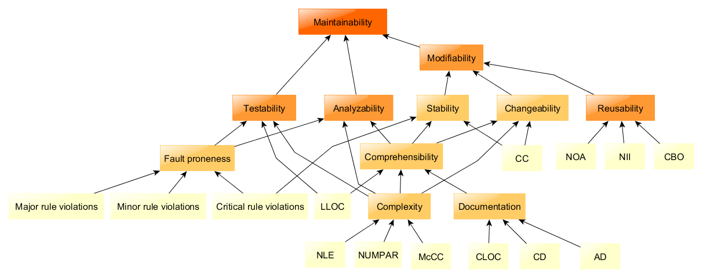
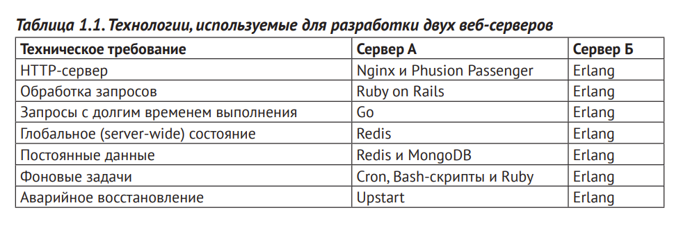

Это вторая статья в цикле "Выбор стека технологий".

[1. Выбор стека технологий (введение и кейсы)](/stack-1)

В первой статье мы определили содержание стека технологий. Это:
- хранилище данных
- бэкенд-фреймворк
- фронтенд-фреймворк
- системы виртуализации/контейнеризации
- DevOps (IaC, мониторинг, логгирование), например, ELK (Elasticsearch, Logstash, Kibana)

---

Доступность (reliability)
-

Доступность измеряется отношением общества количества запросов к количеству неответов. 

Вернемся к кейсам и ранжируем их по требованиям к надежности:

EdTech - SLA 99.999% прописано в контракте (5 минут в год на обслуживание)

HR-Tech - business-critical, SLA 99.99%

PropTech - 2 часа offline в неделю, при том, что это PWA вполне допустимо.

FinTech - консоль SaaS будет использоваться раз в месяц, даже если пролежит неделю - не критично

Blog - мой блог лежал полгода и переезжал с домена на домен, самый менее критичный продукт с требованием к персистентности больше чем к доступности

По стеку что выбрано в результате и на ходу:

EdTech - Postgres, Java 17 Spring Boot, Low-Code, Next.js (SSG+Nginx), Tailwind, отдельный человек-SRE (Docker, minio, Yandex Cloud Kubernetes) - с появлением Java 19, пророчу Java долгую, но сложную жизнь 

HR-Tech - Postgres, Java microservices, Angular 1X, Kafka, Shared SRE (0.3 FTE)

PropTech - MongoDB, Redis, Nest.js, React, no devops - MongoDB падает на 200 пользователях, переписать на Postgres - полгода работы пары человек минимум

FinTech - .Net Core (потому что Azure AD), Angular

Blog - GitHub Pages, VuePress, Markdown

По факту, как ни смешно, самым надежным оказался блог на GitHub Pages. Простота = надежность.

На других проектах DevOps-практика подкачала, деплои были большей частью ручные, а релизы - нестабильные.

Вывод - доступность приложения целиком и полностью зависит от Ops и инфраструктуры. Это база, которая закладывается на старте проекта.

Поэтому если доступность одно из требований, уже при инициализации проекта должны быть настроены бэкапы и восстановление, мониторинг, система оповещений об инцидентах, пайплайн поставок, тестовые стенды и простейшие автотесты.

Здесь мой выбор пал на GitLab, Jenkins и AWS. Ввиду отсутствия альтернатив. В случае российских проектов, Yandex Cloud достаточно production-ready с отзывчивой поддержкой.

Поддерживаемость
-

По стандарту ISO/IEC 25010 поддерживаемость - набор атрибутов, содержащих необходимые усилия для внесения изменений. 

Чтобы что-то изменить, это нужно - проанализировать, изменить, отладить и протестировать.

Как человек, проведший огромное количество времени за реверс-инженерией legacy-кода, я ставлю этот атрибут вторым параметром в уравнение поиска идеального стека.

Java 19 догнал в развитии Elixir/Erlang спустя 30 лет этой гонки.

Тем не менее, поддерживаемым код паралельных процессов и всего остального на Java назвать сложно.

Недаром в последнем опросе пользовательских предпочтений StackOverflow, Elixir на втором месте.

Если бы проекты можно было писать без оглядки на рынок, я бы взял для бэкенда Elixir. Ибо любой разработчик поймет код который на нем написан. И сможет писать на нем уже через пару недель. А вот с Java не так.

Elixir это не только синтаксис, сколько среда выполнения, обратите внимание на табличку ниже из книги Elixir in Action:

Несмотря на то, что Elixir медленнее компилируемых языков, в плане реализации высокодоступных систем ему нет равных. 

Поэтому если бы я выбирал стек технологий снова, он был бы таким:

EdTech - Postgres, Phoenix LiveView, Tailwind

HR-Tech - Postgres, Phoenix LiveView, Kafka

PropTech - просто убрал бы пересчет аналитики в транзакции, JS-стек стартапу подошел хорошо

FinTech - .Net Core (потому что Azure AD), Angular - по-другому никак

Blog - GitHub Pages, VuePress, Markdown - идеально